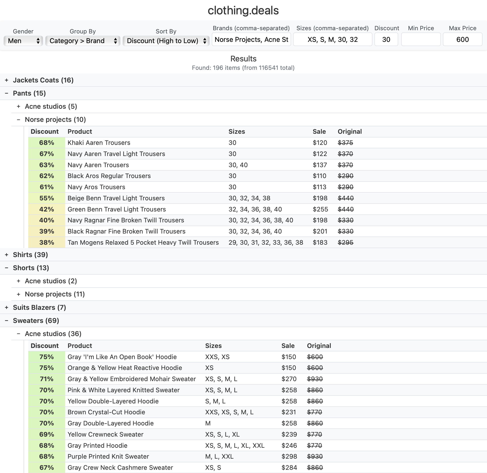

# clothing.deals



An automated web scraper and interactive front-end designed to find the best clothing sales across multiple retailers. This tool efficiently scrapes hundreds of thousands of products, handles anti-bot measures, and presents the data in a fast, filterable, and user-friendly interface.

## Key Features

-   **High-Performance Scraping**: Built with Python's `asyncio` and `Patchright` to scrape thousands of items concurrently, stealthily, and efficiently.
-   **Intelligent Data Collection**: Optimizes requests by first fetching metadata to determine the exact number of pages and size variations to scrape, minimizing redundant calls.
-   **CAPTCHA Handling**: Opens a browser window when a CAPTCHA is detected, pausing the scrape and allowing the user to solve it manually before seamlessly resuming.
-   **Dynamic & Responsive Frontend**: A pure JavaScript interface that filters, sorts, and groups data instantly without page reloads.
-   **Powerful Filtering & Sorting**:
    -   Filter by gender, brand, size, discount percentage, and price range.
    -   Group results by `Category > Brand` or `Brand > Category`.
    -   Sort by highest discount or lowest price.

## Getting Started

Follow these instructions to get a local copy up and running.

### Prerequisites

-   Python 3.9 or newer
-   pip (Python package installer)

### Installation

1.  **Clone the repository:**
    ```sh
    git clone https://github.com/your-username/clothing.deals.git
    cd clothing.deals
    ```

2.  **Create and activate a virtual environment:**
    -   **macOS/Linux:**
        ```sh
        python3 -m venv venv
        source venv/bin/activate
        ```
    -   **Windows:**
        ```sh
        python -m venv venv
        .\venv\Scripts\activate
        ```

3.  **Install Python dependencies from `requirements.txt`:**
    ```sh
    pip install -r requirements.txt
    ```

## Usage


#### Step 1: Run the Scraper

Execute the scraper script from your terminal. This will fetch all the product data and save it as `data.json` in the root directory.

```sh
python app.py
```

-   **Important**: If a CAPTCHA is detected, a Chrome browser window will open. You must solve the CAPTCHA in that window to allow the script to continue.

#### Step 2: View the App

Open your web browser and navigate to:

[http://localhost:8000](http://localhost:8000)

You should now see the `clothing.deals` interface, fully loaded with the data you just scraped.
