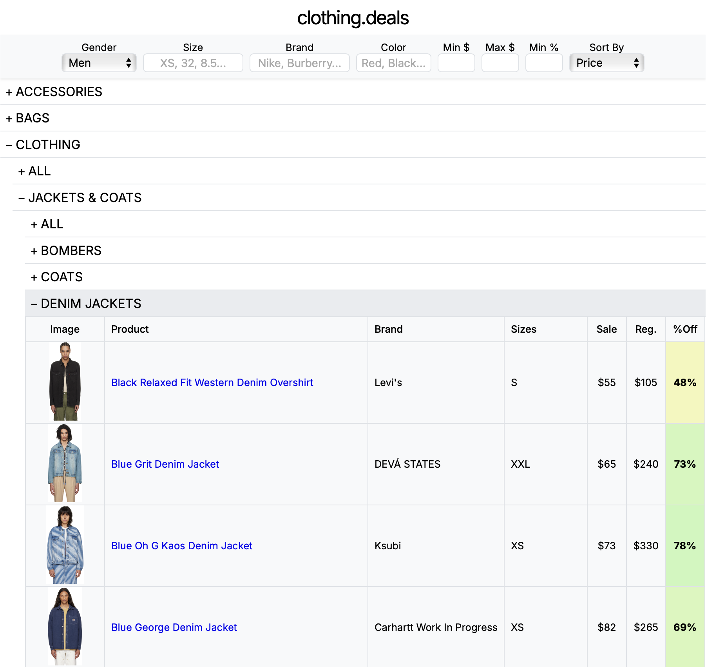
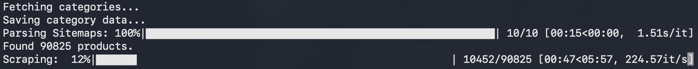

# clothing.deals



An automated web scraper and interactive front-end designed to find the best clothing sales across multiple retailers. This tool efficiently scrapes hundreds of thousands of products, handles anti-bot measures, and presents the data in a fast and user-friendly interface inspired by [RockAuto](https://www.rockauto.com).

## Key Features

-   **High-Performance Scraping**: Built with `asyncio` and `Patchright` to scrape thousands of items concurrently, stealthily, and efficiently.
-   **Efficient Data Collection**: Unlike other scrapers, clothing.deals gets the goods **WITHOUT** loading the website's HTML, directly from the source.
-   **CAPTCHA Handling**: On the rare occasion a CAPTCHA is detected, clothing.deals pauses to allow the user to solve it, before automatically resuming.
-   **Dynamic & Responsive Frontend**: A pure JavaScript interface that filters, sorts, and groups data instantly without page reloads.

## Installation

1.  **Clone the repository:**
    ```sh
    git clone https://github.com/dh60/clothing.deals.git
    ```
    ```sh
    cd clothing.deals
    ```

2.  **Create and activate a virtual environment:**
    -   **macOS/Linux:**
        ```sh
        python3 -m venv venv
        ```
        ```sh
        source venv/bin/activate
        ```
    -   **Windows:**
        ```sh
        python -m venv venv
        ```
        ```sh
        .\venv\Scripts\activate
        ```

3.  **Install Python dependencies from `requirements.txt`:**
    ```sh
    pip install -r requirements.txt
    ```

4.  **Install Chrome (if you don't have it)**
    ```sh
    patchright install chrome
    ```


## Usage


#### Step 1: Run the Scraper

```sh
python ssense.py
```

-   **Important**: If a CAPTCHA is detected, a Chrome browser window will open. You must solve the CAPTCHA, then the script will automatically resume.

#### Step 2: Run the server and view the app.

```sh
python run.py
```

Then open your browser and go to:
[http://localhost:8000](http://localhost:8000)
