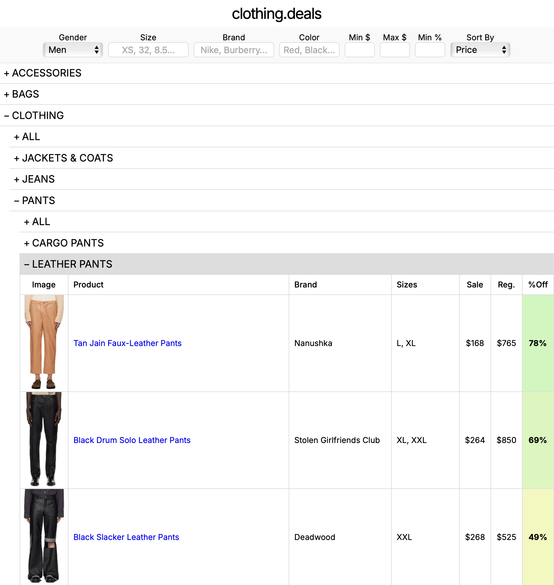

# clothing.deals



A high-performance web scraper and single-page application for browsing clothing deals. Scrapes thousands of products concurrently and provides an instantaneously filterable interface for finding deals.

## Key Features

-   **High-Performance Scraping**: Built with `asyncio` and `Patchright` to scrape thousands of products simultaneously.
-   **Direct JSON Extraction**: Fetches product data directly from JSON endpoints via browser-based fetch calls, bypassing HTML parsing.
-   **Optimized Data Storage**: Uses Brotli compression to store product and category data efficiently.
-   **Fast Filtering Frontend**: Pure JavaScript single-page app with zero dependencies. Features lazy-loading product tables, inline image viewing, and instant search across brand, size, color, price, and discount.

## Usage


#### Step 1: Run the Scrapers

```sh
python scrape_ssense.py && python scrape_thelasthunt.py
```

#### Step 2: Run the server and view the app.

```sh
python server.py
```

A tab should automatically open in your browser.

## Installation
[Python 3.10 or higher required. The latest version is recommended.](https://www.python.org/downloads/)

Open your terminal, then enter these commands:

1.  **Clone the repository:**
    ```sh
    git clone https://github.com/dh60/clothing.deals.git
    ```
    ```sh
    cd clothing.deals
    ```

2.  **Create and activate a virtual environment:**
    -   **macOS/Linux:**
        ```sh
        python3 -m venv venv && source venv/bin/activate
        ```
    -   **Windows:**
        ```sh
        python -m venv venv
        ```
        ```sh
        .\venv\Scripts\activate
        ```

3.  **Install dependencies:**
    ```sh
    pip install -r requirements.txt && patchright install chromium --no-shell
    ```

Now you can get started! Start by running the scraper (see Usage).
